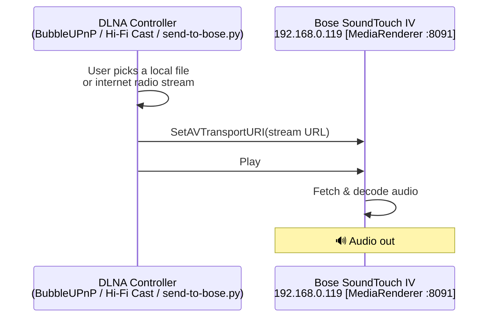
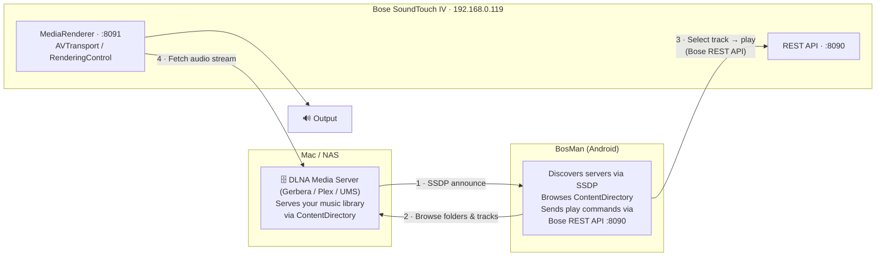
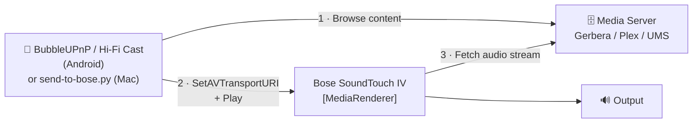

# Bose Wave SoundTouch IV — Community Toolkit

Tools and guides for keeping a **Bose Wave SoundTouch IV** useful on your home
network after Bose shut down the SoundTouch cloud (May 2026). This repository
covers Wi-Fi recovery, local control via [BosMan](bosman-soundtouch-iv-controller/),
and streaming music over DLNA/UPnP without Bose's apps or servers.

---

## Repository contents

| Path | What it is |
|------|------------|
| [`bosman-soundtouch-iv-controller/`](bosman-soundtouch-iv-controller/) | BosMan — web/Android app for volume, presets, zones, and DLNA browsing |
| [`dlna-sender/`](dlna-sender/) | `send-to-bose.py` — zero-install macOS script to push files, folders, and streams to the Bose |
| [`bose-usb-flash/`](bose-usb-flash/) | Offline USB firmware reflash when the pedestal is stuck |
| [`bluetooth-setup/`](bluetooth-setup/) | macOS helpers for pairing the Bose over Bluetooth |
| [`vlc-upnp-renderer/`](vlc-upnp-renderer/) | VLC plugin to cast to UPnP/DLNA renderers — Bose appears in **Playback → Renderer** (see [README](vlc-upnp-renderer/README.md)) |

---

## Documentation

| Guide | Use when |
|-------|----------|
| **This file** | Streaming music over DLNA/UPnP, choosing apps, understanding architecture |
| [`bose-usb-flash/README.flash.md`](bose-usb-flash/README.flash.md) | Pedestal stuck — Wi-Fi AP up but no TCP ports respond |
| [`bosman-soundtouch-iv-controller/README.md`](bosman-soundtouch-iv-controller/README.md) | Running and developing the BosMan app |
| [`README.SoundTouchIV-wifi.md`](README.SoundTouchIV-wifi.md) | Wi-Fi setup protocol, field diagnostics, root-cause analysis |

---

## Quick start — stream music now

No media server required. Pick your platform and play:

**Android — BubbleUPnP**
1. Install [BubbleUPnP](https://play.google.com/store/apps/details?id=com.bubblesoft.android.bubbleupnp).
2. Tap the **Renderer** icon (top-right) → select **"Bose SoundTouch 90E9CA"**.
3. **Library → Local** → tap a track → **Play**.

**Mac — VLC (with plugin)**
```sh
cd vlc-upnp-renderer && ./install.sh
# Open VLC → Playback → Renderer → Bose SoundTouch → play a file or stream
```

**Mac — Python script (no installs)**
```sh
# Play a local file
python3 dlna-sender/send-to-bose.py /path/to/song.mp3

# Play all audio files in a folder (sorted by filename, one after another)
python3 dlna-sender/send-to-bose.py /path/to/album/

# Play an internet-radio URL
python3 dlna-sender/send-to-bose.py http://stream.example.com/radio.mp3

# Stop
python3 dlna-sender/send-to-bose.py --stop

# Set volume (0-100)
python3 dlna-sender/send-to-bose.py --volume 40
```

The script auto-discovers the Bose via SSDP, serves local files or folders over a
temporary HTTP server, and sends SOAP commands directly — no VLC, no plugins.

> **Stock VLC does not work for this.** VLC 3.x "Playback → Renderer" discovers only
> **Chromecast** and **AirPlay** devices, not standard UPnP/DLNA `MediaRenderer:1`
> devices. Install the [`vlc-upnp-renderer`](vlc-upnp-renderer/) plugin to make the
> Bose appear there, or use the Python script, **Elmedia Player**, or **Swinsian** on Mac.

---

## How the Bose works on your network

When powered on and connected to Wi-Fi, the Bose SoundTouch IV advertises itself
over UPnP/DLNA as a **MediaRenderer**. It can receive play commands and fetch audio
from a URL or media server, but it cannot serve music to other devices. Any UPnP
AV **controller** app can discover it and push content to it.

| Role | What it does | Example on your network |
|------|-------------|------------------------|
| **MediaRenderer (DMR)** | Plays audio directed to it | Bose SoundTouch IV (`192.168.0.119`) |
| **MediaServer (DMS)** | Serves a music library | Gerbera / Plex / UMS on your Mac or NAS |
| **Controller (DMC)** | Browses servers, tells renderers to play | BubbleUPnP / BosMan / `send-to-bose.py` |

Your Bose is always the renderer. The controller and (optionally) the media server
are separate pieces you choose.

---

## Streaming approaches

Three common patterns. All end with the Bose fetching and playing audio.

### Method A — Controller pushes a file or URL directly

No media server. The controller holds the content URL (local file, folder of
tracks, internet radio, etc.) and commands the Bose to fetch and play it.



**Use when:** playing files from phone/Mac storage or internet radio with no extra software.

### Method B — BosMan browses a media server

BosMan discovers DLNA media servers via SSDP, lets you browse their libraries, and
commands the Bose to play a chosen track.



**Use when:** your music lives on a Mac or NAS and you want to browse it from BosMan.

### Method C — Third-party controller + media server

Same as Method B but using BubbleUPnP, Hi-Fi Cast, or another DLNA controller
instead of BosMan.



**Use when:** you prefer a dedicated DLNA controller app over BosMan's built-in browser.

---

## macOS apps

### Media servers — serve your music library

Run one of these on your Mac. Once running it announces itself via SSDP and
BosMan's Media tab (or BubbleUPnP) discovers it automatically.

| App | Cost | Notes |
|-----|------|-------|
| **Universal Media Server** | Free | Best all-round choice; Java, no config needed, auto-transcodes. [universalmediaserver.com](https://www.universalmediaserver.com) |
| **Gerbera** | Free / OSS | Lightweight, music-focused, web UI on port 49494. Sample config in `bosman-soundtouch-iv-controller/gerbera/`. [gerbera.io](https://gerbera.io) |
| **Jellyfin** | Free / OSS | Full media server with DLNA enabled by default. [jellyfin.org](https://jellyfin.org) |
| **Plex Media Server** | Free | DLNA built-in (Settings → Remote Access → DLNA Server). [plex.tv](https://www.plex.tv) |
| **Serviio** | Free basic | Clean UI, on-the-fly transcoding. [serviio.org](https://serviio.org) |

**Quick start — Universal Media Server:**
```sh
# 1. Download and install from https://www.universalmediaserver.com
# 2. Launch UMS; web UI at http://localhost:9001
# 3. Add your music folder under "Shared content"
# 4. UMS announces via SSDP — BosMan's Media tab finds it in seconds
```

**Quick start — Gerbera:**
```sh
brew install gerbera
gerbera --config bosman-soundtouch-iv-controller/gerbera/config.xml
# Web UI: http://localhost:49494
```

### Controllers — push music directly to the Bose

| App | Cost | Notes |
|-----|------|-------|
| **`send-to-bose.py`** | Free (included) | Zero-install Python script. `python3 dlna-sender/send-to-bose.py song.mp3` or `.../album/` |
| **VLC + `vlc-upnp-renderer`** | Free (included) | Adds UPnP/DLNA renderers to **Playback → Renderer**. `cd vlc-upnp-renderer && ./install.sh` |
| **Elmedia Player** | Free / Pro | Native macOS app with UPnP renderer casting. [elmedia-player.com](https://www.elmedia-player.com) |
| **Swinsian** | Paid (one-time) | Native macOS player with built-in DLNA output. [swinsian.com](https://swinsian.com) |
| **foobar2000** | Free | UPnP output plugin is Windows-only; macOS version does not support renderer output. |

**`send-to-bose.py` step-by-step:**
```sh
python3 dlna-sender/send-to-bose.py /path/to/music.mp3
# → "Scanning for DLNA renderers (4s) ..."
# → "Found: Bose SoundTouch 90E9CA"
# → "Serving: /path/to/music.mp3"
# → "Playing. Press Ctrl+C to stop."

python3 dlna-sender/send-to-bose.py /path/to/album/
# → "Serving folder: /path/to/album/ (12 tracks)"
# → "[1/12] 01-track.mp3" … plays each file in sorted order
```

The Bose fetches audio from your Mac over HTTP while the script runs.
For a single file, press Ctrl+C to stop. For a folder, tracks play through
automatically; Ctrl+C stops the current track and shuts down the server.

---

## Android apps

DLNA controllers — browse media servers and command the Bose renderer to play.

| App | Cost | Highlights |
|-----|------|-----------|
| **BubbleUPnP** | Free + £5 licence | Best overall. DLNA servers, local files, internet radio, cloud. Install this first. |
| **Hi-Fi Cast + DLNA** | Free + Pro | Clean, focused UI. Excellent renderer control. |
| **Kinsky** | Free | Linn's open-source UPnP controller. Music-focused. |
| **LocalCast** | Free + Pro | Optimised for casting files from phone storage. |
| **MediaHouse UPnP/DLNA** | Free | Lightweight content browser. |
| **AllConnect** | Free + Pro | Local files, Spotify, and internet radio to DLNA renderers. |

### BubbleUPnP quick start (recommended)

```
1. Install BubbleUPnP from the Play Store.

2. Grant Local Network / Nearby Devices permission when prompted.

3. Tap the Renderer icon (top-right).
   → "Bose SoundTouch 90E9CA" should appear within ~3 seconds.
   → Tap it to select the Bose as the active renderer.

4. Open Library:
   • Local      → music on your phone
   • UPnP/DLNA  → browse a Gerbera / Plex / UMS server on your Mac
   • Internet   → internet radio stations

5. Tap a track → Play. Audio plays on the Bose.

6. Volume slider in BubbleUPnP controls the Bose volume remotely.

7. To play a whole album: long-press the album → Add to Queue → Play.
```

---

## BosMan Media tab

BosMan's Media tab is a built-in DLNA controller. Workflow:

```
Open BosMan → tap 🎵 (Media tab) → expand "Media Server (Bose SoundTouch 90E9CA)"

Step 1  "Discover Media Servers"
        SSDP M-SEARCH to 239.255.255.250:1900; classifies replies as
        server (ContentDirectory), renderer (AVTransport), or other.
        Takes ~3–5 seconds.

Step 2  Media server list
        Gerbera / Plex / UMS appear as tappable rows.
        If only "Other UPnP devices" shows, no DLNA server is running —
        start Gerbera, UMS, or Plex on your Mac or NAS.

Step 3  Browse
        Tap a server → ContentDirectory browse (folders, albums, playlists).

Step 4  Play
        Tap a track → BosMan calls the Bose REST API on port 8090.
        The Bose fetches audio from the media server directly.
```

The "Other UPnP devices" section lists UPnP devices that are not ContentDirectory
servers — including the Bose itself (a renderer, not a server).

---

## Supported audio formats

The Bose **decodes** audio on the pedestal — your controller only hands it a URL. If the
format is unsupported, the cast can look successful (transport shows *Playing*) but you
get silence or the track skips immediately.

**Wave SoundTouch IV (this repo's focus)** — tested on a live unit (`90E9CA`):

| Format | Plays on Wave IV? | Notes |
|--------|-------------------|-------|
| **MP3** | Yes | Most reliable for direct casting |
| **AAC / M4A** | Yes | Unprotected AAC only (not old iTunes DRM) |
| **WMA** | Yes | |
| **WAV** | Yes | |
| **FLAC** | **No** | Cast succeeds but the Bose does not decode FLAC |
| **OGG / Opus** | No | Not supported on the older Gabbo/SM1 firmware |

**Newer standalone SoundTouch speakers** (SoundTouch 10/20/30 and similar SM2-era
models) reportedly accept a wider set — community testing found **FLAC, OGG, and WAV**
in addition to MP3/AAC/WMA. This repo has not verified every later model; if FLAC
matters to you, test on your hardware or let a media server transcode to MP3.

**Workarounds for FLAC libraries:**

- Transcode to MP3/AAC before casting (`ffmpeg -i track.flac -q:a 2 track.mp3`).
- Use a DLNA media server with on-the-fly transcoding (UMS, Serviio, Plex) and browse
  from BubbleUPnP or BosMan rather than pushing raw FLAC files.

`send-to-bose.py` and the VLC plugin will happily *serve* FLAC over HTTP — that only
means the URL is reachable, not that the Bose can play it.

---

## What works (and what doesn't)

| What you want to do | Works? | How |
|--------------------|--------|-----|
| Play MP3/AAC/WAV from Android phone | Yes | BubbleUPnP → Renderer = Bose |
| Play FLAC on Wave SoundTouch IV | No | Transcode to MP3/AAC, or use a server that transcodes |
| Play files from Mac | Yes | `send-to-bose.py`, VLC + `vlc-upnp-renderer`, Elmedia Player, or Swinsian (use MP3/AAC/WAV on Wave IV) |
| Browse Mac music library in BosMan | Yes | Run UMS/Gerbera on Mac + BosMan Media tab |
| Browse Mac music library in BubbleUPnP | Yes | Run UMS/Gerbera on Mac + BubbleUPnP Library → UPnP/DLNA |
| Internet radio on the Bose | Yes | BubbleUPnP → Internet Radio → Renderer = Bose |
| Spotify / Apple Music | No (DLNA only) | Use BubbleUPnP + phone output, or AllConnect |
| AirPlay from iPhone or Mac | Not natively | Needs [Shairport Sync](https://github.com/mikebrady/shairport-sync) as a bridge |
| Bluetooth from phone | Yes | Pair phone to Bose directly, or use `bluetooth-setup/` on Mac |
| Multi-room sync with other Bose devices | Yes | BosMan → Zones tab → create Master/Member group |
| TuneIn / cloud presets | No (Bose cloud gone) | Use [SoundCork](https://github.com/timvw/soundcork) to self-host a cloud replacement |