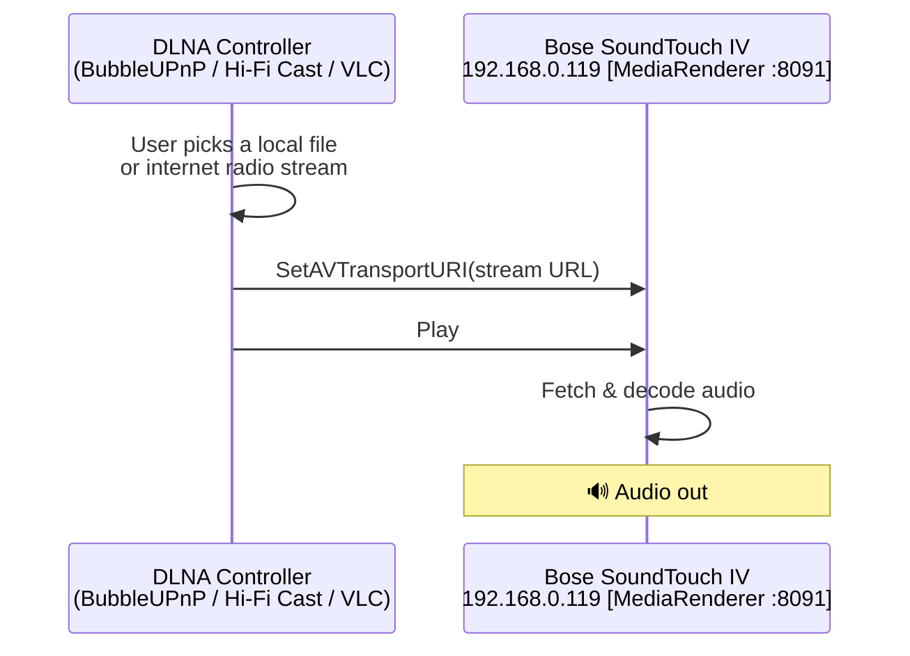
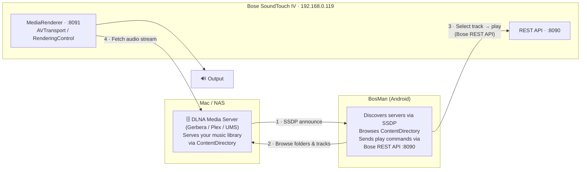
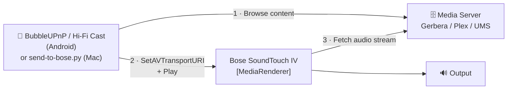

# Playing Music on Your Bose SoundTouch IV — DLNA/UPnP Guide

This document explains how to stream music to your **Bose Wave SoundTouch IV** over
your home network now that it is connected via Wi-Fi. It covers the architecture
(with diagrams), ready-to-use apps for macOS and Android, how BosMan's Media tab
fits in, and a quick-start for each approach.

---

## TL;DR — stream music right now (no server needed)

The fastest path to audio on the Bose today, with zero server setup:

**Android — BubbleUPnP**
1. Install [BubbleUPnP](https://play.google.com/store/apps/details?id=com.bubblesoft.android.bubbleupnp) from the Play Store.
2. Open it → tap the **Renderer** icon (top-right) → select **"Bose SoundTouch 90E9CA"**.
3. Go to **Library → Local** (your phone's music) → tap a track → **Play**.
4. Audio plays on the Bose. Done.

**Mac — Python script (no installs)**
```sh
# Play a local file
python3 tools/send-to-bose.py /path/to/song.mp3

# Play an internet-radio URL
python3 tools/send-to-bose.py http://stream.example.com/radio.mp3

# Stop
python3 tools/send-to-bose.py --stop

# Set volume (0-100)
python3 tools/send-to-bose.py --volume 40
```
The script auto-discovers the Bose via SSDP, serves local files via a temporary
HTTP server, and sends SOAP commands directly — no VLC, no plugins.

> **Note on VLC**: VLC 3.x "Playback → Renderer" only discovers **Chromecast** and
> **AirPlay** devices. It does not discover standard UPnP/DLNA `MediaRenderer:1`
> devices, so the Bose will never appear there. Use the Python script or
> **Elmedia Player** instead.

---

## What the Bose SoundTouch IV is on the network

When powered on and connected to Wi-Fi, the Bose SoundTouch IV advertises itself
over UPnP/DLNA as a **MediaRenderer**. This means:

- It can **receive commands** to play audio from a URL or media server.
- It **cannot serve** music files to other devices.
- Any UPnP AV **controller** app can discover it and push content to it.

The three roles in a DLNA/UPnP setup:

| Role | What it does | Example on your network |
|------|-------------|------------------------|
| **MediaRenderer (DMR)** | Plays audio directed to it | Bose SoundTouch IV (`192.168.0.119`) |
| **MediaServer (DMS)** | Serves a music library | Gerbera / Plex / UMS on your Mac or NAS |
| **Controller (DMC)** | Browses servers, tells renderers to play | BubbleUPnP / BosMan / VLC |

Your Bose is **always the renderer**. The controller and (optionally) the media server
are separate pieces you choose.

---

## Architecture diagrams

### Method A — Controller pushes a file or URL directly to the Bose

No media server required. The controller app holds the content URL (local file,
internet radio, etc.) and commands the Bose to fetch and play it.



**Use this when:** you want to play files from your phone/Mac storage, or internet
radio, with no extra software.

---

### Method B — BosMan browses a media server and plays on the Bose

BosMan acts as the controller. It discovers DLNA media servers on the network via
SSDP, lets you browse their libraries, and commands the Bose to play a chosen track.



**Use this when:** your music lives on a Mac or NAS and you want to browse it
from BosMan without any third-party app.

---

### Method C — Third-party controller browses a server and drives the Bose

Same as Method B but using BubbleUPnP, Hi-Fi Cast, or another DLNA controller
instead of BosMan. The controller browses the media server and then tells the
Bose renderer to play.



**Use this when:** you prefer a dedicated DLNA controller app over BosMan's
built-in browser.

---

## macOS apps

### Media servers — serve your music library to the Bose

Run one of these on your Mac. Once running it announces itself via SSDP and
BosMan's Media tab (or BubbleUPnP) discovers it automatically.

| App | Cost | Notes |
|-----|------|-------|
| **Universal Media Server** | Free | Best all-round choice; Java, no config needed, auto-transcodes. [universalmediaserver.com](https://www.universalmediaserver.com) |
| **Gerbera** | Free / OSS | Lightweight, music-focused, web UI on port 49494. A sample config is in `bosman-soundtouch-iv-controller/gerbera/`. [gerbera.io](https://gerbera.io) |
| **Jellyfin** | Free / OSS | Full media server with DLNA enabled by default; excellent web UI. [jellyfin.org](https://jellyfin.org) |
| **Plex Media Server** | Free | DLNA built-in (Settings → Remote Access → DLNA Server). [plex.tv](https://www.plex.tv) |
| **Serviio** | Free basic | Clean UI, on-the-fly transcoding. [serviio.org](https://serviio.org) |

**Quick start — Universal Media Server:**
```sh
# 1. Download and install from https://www.universalmediaserver.com
# 2. Launch UMS; it opens a web UI at http://localhost:9001
# 3. Add your music folder under "Shared content"
# 4. UMS announces via SSDP — BosMan's Media tab finds it in seconds
```

**Quick start — Gerbera:**
```sh
brew install gerbera
gerbera --config bosman-soundtouch-iv-controller/gerbera/config.xml
# Web UI: http://localhost:49494
```

### DLNA controllers — push music from your Mac directly to the Bose

| App | Cost | Notes |
|-----|------|-------|
| **`send-to-bose.py`** | Free (included) | Zero-install Python script. Auto-discovers Bose via SSDP, serves local files, sends SOAP play commands. `python3 tools/send-to-bose.py song.mp3` |
| **Elmedia Player** | Free / Pro | Native macOS app with a toolbar cast button that discovers UPnP/DLNA renderers. Pro licence unlocks renderer casting. [elmedia-player.com](https://www.elmedia-player.com) |
| **Swinsian** | Paid (one-time) | Native macOS music player (iTunes-style library). Has built-in DLNA renderer support — select the Bose as output device from the menu bar. [swinsian.com](https://swinsian.com) |
| **foobar2000** | Free | The UPnP output plugin (`foo_upnp`) is Windows-only. The macOS version of foobar2000 does **not** support UPnP renderer output. Do not rely on this on Mac. [foobar2000.org](https://www.foobar2000.org/mac) |

> **VLC limitation**: VLC 3.x "Playback → Renderer" discovers only **Chromecast** and
> **AirPlay** devices via Bonjour/mDNS. It has no UPnP `MediaRenderer:1` renderer
> discovery. The Bose will never appear in VLC's Renderer menu. Use
> `send-to-bose.py`, Elmedia Player, or Swinsian instead.

**`send-to-bose.py` step-by-step:**
```sh
# From the repo root:
python3 tools/send-to-bose.py /path/to/music.mp3
# → "Scanning for DLNA renderers (4s) ..."
# → "Found: Bose SoundTouch 90E9CA"
# → "Serving: /path/to/music.mp3"
# → "Playing. Press Ctrl+C to stop."
```
The Bose fetches the file directly from your Mac over HTTP while the script is running.
Press Ctrl+C to stop playback and shut down the temporary server.

---

## Android apps

These act as **DLNA controllers** — they browse media servers and command
the Bose renderer to play. Install one and you have full control over the
Bose from your phone.

| App | Cost | Highlights |
|-----|------|-----------|
| **BubbleUPnP** | Free + £5 licence | Best overall. Browse DLNA servers, local files, internet radio, cloud services. Control volume. Install this first. |
| **Hi-Fi Cast + DLNA** | Free + Pro | Clean, focused UI. Excellent renderer control. Good choice if you prefer a simpler interface. |
| **Kinsky** | Free | Linn's open-source UPnP controller. Music-focused, no frills. |
| **LocalCast** | Free + Pro | Optimised for casting files from phone storage to a renderer. |
| **MediaHouse UPnP/DLNA** | Free | Lightweight content browser. Good for quick exploration. |
| **AllConnect** | Free + Pro | Streams local files, Spotify, and internet radio to DLNA renderers. |

### BubbleUPnP quick start (recommended)

```
1. Install BubbleUPnP from the Play Store.

2. Grant Local Network / Nearby Devices permission when prompted.

3. Tap the Renderer icon (top-right, looks like a speaker/screen).
   → "Bose SoundTouch 90E9CA" should appear within ~3 seconds.
   → Tap it to select the Bose as the active renderer.

4. Open Library:
   • Local      → music on your phone
   • UPnP/DLNA  → browse a Gerbera / Plex / UMS server on your Mac
   • Internet   → internet radio stations

5. Tap a track → Play. Audio plays on the Bose.

6. Volume slider in BubbleUPnP controls the Bose volume remotely.

7. To play a whole album: long-press the album → Add to Queue → Play.
```

---

## How BosMan's "Media Server" tab works

BosMan's Media tab is a built-in DLNA controller for the Bose. Here is
exactly what each step does:

```
BosMan Media tab workflow
─────────────────────────
Open BosMan → tap 🎵 (Media tab) → expand "Media Server (Bose SoundTouch 90E9CA)"

Step 1  "Discover Media Servers" button
        BosMan sends a UPnP SSDP M-SEARCH multicast to 239.255.255.250:1900.
        Every DLNA device on the network replies with its LOCATION URL.
        BosMan fetches each device description, classifies it as:
          • server   → ContentDirectory present → can browse
          • renderer → AVTransport present     → listed under "Other UPnP devices"
          • other    → router, AP, etc.
        Takes ~3–5 seconds.

Step 2  Media server list
        Any server (Gerbera / Plex / UMS) appears here as a tappable row.
        If the list shows only "Other UPnP devices", no DLNA media server is
        running — start Gerbera, UMS, or Plex on your Mac or NAS.

Step 3  Browse
        Tap a server → BosMan queries its ContentDirectory (UPnP Browse action).
        Navigate folders (albums, artists, playlists) just like a file browser.

Step 4  Play
        Tap a track → BosMan calls the Bose REST API on port 8090 to play
        that track's stream URL. The Bose fetches audio from the media server
        directly and plays it through the speaker.
```

The "Other UPnP devices" section (Bose, LG TV, etc.) shows every UPnP device
SSDP found but which is **not** a ContentDirectory server — so they cannot be
browsed. The Bose itself appears here because it is a renderer, not a server.

---

## Setting up Gerbera on macOS (step-by-step)

Gerbera is the lightest option and a config is already in this repository.

```sh
# Install
brew install gerbera

# Run with the sample config
gerbera --config bosman-soundtouch-iv-controller/gerbera/config.xml

# Or run with defaults (creates ~/.config/gerbera/config.xml on first launch)
gerbera

# Web UI (add your music folders here)
open http://localhost:49494

# Gerbera announces itself via SSDP immediately.
# Open BosMan → Media tab → Discover → Gerbera appears as a server.
```

---

## Capability summary

| What you want to do | Works? | How |
|--------------------|--------|-----|
| Play files from Android phone | Yes | BubbleUPnP → Renderer = Bose |
| Play files from Mac | Yes | `python3 tools/send-to-bose.py file.mp3` or Elmedia Player |
| Browse Mac music library in BosMan | Yes | Run UMS/Gerbera on Mac + BosMan Media tab |
| Browse Mac music library in BubbleUPnP | Yes | Run UMS/Gerbera on Mac + BubbleUPnP Library → UPnP/DLNA |
| Internet radio on the Bose | Yes | BubbleUPnP → Internet Radio → Renderer = Bose |
| Spotify / Apple Music | No (DLNA only) | Spotify Connect is not available; use BubbleUPnP + Spotify via phone output or use AllConnect |
| AirPlay from iPhone or Mac | Not natively | Needs [Shairport Sync](https://github.com/mikebrady/shairport-sync) on a Raspberry Pi / server acting as a bridge |
| Bluetooth from phone | Yes | Pair phone to Bose directly over Bluetooth |
| Multi-room sync with other Bose devices | Yes | BosMan → Zones tab → create Master/Member group |
| TuneIn / cloud presets | No (Bose cloud gone) | Use [SoundCork](https://github.com/timvw/soundcork) to self-host a cloud replacement |

---

## Related documentation

| File | Contents |
|------|---------|
| [`tools/send-to-bose.py`](tools/send-to-bose.py) | Python DLNA sender — play any file or stream on the Bose from macOS |
| [`bose-usb-flash/README.flash.md`](bose-usb-flash/README.flash.md) | Offline USB firmware reflash procedure |
| [`bosman-soundtouch-iv-controller/README.md`](bosman-soundtouch-iv-controller/README.md) | BosMan app overview and quick-start |
| [`bosman-soundtouch-iv-controller/README.SoundTouchIV-wifi.md`](bosman-soundtouch-iv-controller/README.SoundTouchIV-wifi.md) | Wi-Fi setup protocol, field diagnostics, root-cause analysis |
