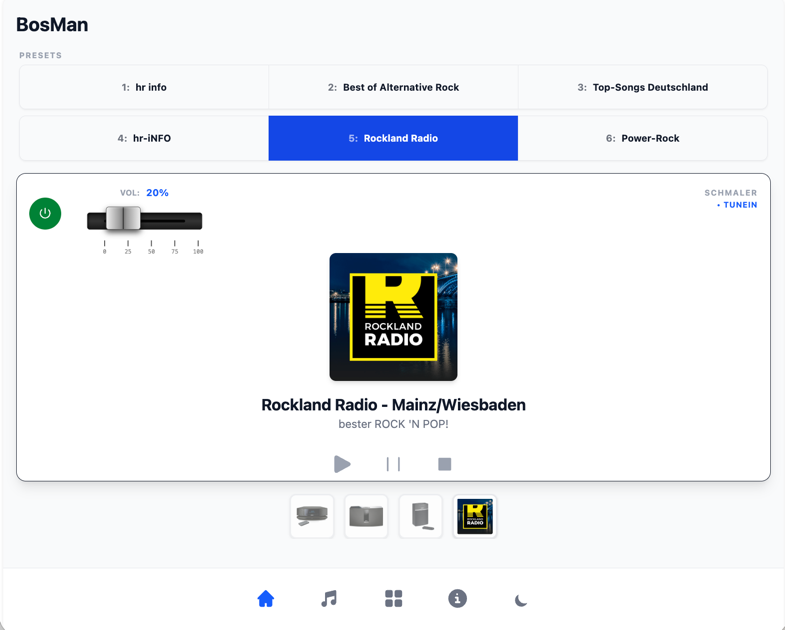

# Bosman — Bose SoundTouch™  Manager

Bosman is a modern, independent open-source solution for managing and controlling Bose SoundTouch™ devices in your local home network.



The app provides an intuitive user interface for controlling volume, playback, presets, and multi-room zones, built with Svelte 5 and modern web technologies.

## ✨ Features

- **Automatic Device Discovery:** Finds SoundTouch devices in the local network using SSDP.
- **Real-time Synchronization:** Status updates (Now Playing, volume) via WebSockets directly from the device.
- **Multi-room Control:** Easily manage zones (Master/Member setups).
- **Preset Management:** Quick access to your stored favorites.
- **Media Server Support:** Browse local DLNA media servers and play content directly on your devices.
- **Modern Interface:** Optimized for desktop and mobile (Capacitor support).

## 🚀 Quick Start

### Prerequisites

- Node.js 18 or higher
- A local network with Bose SoundTouch™ devices

### Installation & Startup

1. Clone the repository:
   ```bash
   git clone https://github.com/your-username/bosman.git
   cd bosman
   ```

2. Install dependencies:
   ```bash
   npm install
   ```

3. Start the development server:
   ```bash
   npm run dev
   ```

Open `http://localhost:5173` in your browser. The app will automatically start searching for devices in your network.

## Wave SoundTouch IV — WiFi setup

BosMan can provision a **Bose Wave SoundTouch Music System IV** onto your home WiFi without the official Bose app. For hardware setup (setup mode, factory reset, stuck firmware), phone configuration (GrapheneOS/Android), and the reverse-engineered Gabbo HTTP protocol, see the repo-wide guide:

**[README.SoundTouchIV-wifi.md](../README.SoundTouchIV-wifi.md)**

### Quick fix: "BosMan can't connect to the Bose"

If BosMan won't connect, **the speaker is almost always not actually in setup mode.** Work through these steps **in order** (full detail in the WiFi guide):

1. **Put the speaker into setup mode** — hold the Control button on the back of the pedestal ~3 s. Success = Wi‑Fi light **solid amber** AND display **`SETUP SEE INSTRUCTIONS`**.
2. **Connect the phone** to the `Bose Wave ST (…)` network. Tap **Stay connected** when warned about no internet.
3. **In BosMan, use the WiFi Setup panel** — **not** "Search devices" / "Connect by IP". Search looks for port 8090, which a speaker in setup mode does not run yet. Pick your home WiFi, enter the password, submit.
4. **Still stuck?** Reset the pedestal (soft restart, then hard reset). See the WiFi guide's [factory reset section](../README.SoundTouchIV-wifi.md#factory-reset--setup-recovery-wave-soundtouch-series-iv).

If resets don't help, the pedestal firmware may be stuck (common after the [Bose cloud shutdown in May 2026](../README.SoundTouchIV-wifi.md#root-cause-2026-bose-cloud-shutdown--stuck-setup-firmware)). BosMan cannot fix that — you need an [offline USB firmware reflash](../bose-usb-flash/README.flash.md) before provisioning will work.

### Configure Android / GrapheneOS for Bose setup WiFi

Bose setup WiFi has no internet; Android often disconnects after a few seconds. Before opening BosMan, configure the phone (see the WiFi guide [Part 2](../README.SoundTouchIV-wifi.md#part-2--configure-your-phone-grapheneos--android)):

- Turn off mobile data
- Connect to the Bose SSID and tap **Stay connected**
- Use **device MAC** (not randomized MAC) for the Bose network
- Turn off Android **Block connections without VPN** if you use a VPN

With USB debugging enabled, run from the repo root:

```bash
chmod +x bosman-soundtouch-iv-controller/scripts/configure-grapheneos-bose-wifi.sh
./bosman-soundtouch-iv-controller/scripts/configure-grapheneos-bose-wifi.sh
```

Or for a different SSID:

```bash
BOSE_SSID="Bose SoundTouch Setup" ./bosman-soundtouch-iv-controller/scripts/configure-grapheneos-bose-wifi.sh
```

The script disables connectivity-check disconnects, turns off mobile data temporarily, connects with device MAC, and opens WiFi settings so you can tap **Stay connected**. You still need that one tap on the phone when Android warns about no internet.

### What BosMan implements

BosMan speaks the Wave IV **Gabbo / SM1 HTTP-form** setup protocol (not the SoundTouch 10 telnet CLI or SM2 WebSocket path):

- Native `httpPost` in `WifiInfoPlugin.java` (bound to the local-only WiFi link)
- `src/lib/bose/setup.ts` — site survey from `/setup/index.asp`, provision via `aformHandlerConfigureProfileSettings`
- **Multi-host gateway probing** — tries last-known-good host, live gateway, then `192.168.1.1` and `192.0.2.1` (real units may use either subnet while speaking the SM1 HTTP protocol)

### Install BosMan (Android)

```bash
npm run deploy:android
```

Or build manually:

```bash
npm run build:mobile
npx cap sync android
cd android && ./gradlew assembleDebug
adb install android/app/build/outputs/apk/debug/app-debug.apk
```

### Use BosMan on Bose setup WiFi

1. Put the speaker in setup mode and keep the phone on the Bose SSID (see WiFi guide Part 1 & 2).
2. Open **BosMan** — it shows the **Set up home WiFi** panel.
3. Tap **Scan for home WiFi networks**, pick your router SSID, enter the password, tap **Connect speaker to home WiFi**.
4. When setup completes, connect the phone to the **same home WiFi** and tap **Search again** — BosMan finds the speaker on port **8090**.

On the setup AP, BosMan talks HTTP to the Gabbo server (port 80) and does **not** expect port 8090 until the speaker joins home WiFi.

Approve the system dialog if Android asks whether BosMan may use the Bose WiFi network (`WifiNetworkSpecifier` holds the local link).

> **Browser alternative:** iOS/Android often block the setup page at `http://192.0.2.1` on no-internet networks. A Mac browser on the Bose SSID works reliably (see the WiFi guide [field-confirmed procedure](../README.SoundTouchIV-wifi.md#field-confirmed-setup-procedure-june-2026)). On Android, use BosMan's WiFi Setup panel instead.

### Everyday use on home WiFi

You do not need to stay on the speaker's setup SSID for normal control:

1. Provision the speaker once (BosMan WiFi Setup panel or a Mac browser).
2. Connect the phone to the **same home WiFi**.
3. Tap **Search devices** — BosMan discovers the speaker via SSDP/network scan on port **8090**.

### What BosMan needs

- **HTTP** on port **8090** — commands, volume, presets, device info
- **WebSocket** on port **8080** — live updates (now playing, volume)

BosMan talks to the speaker over your local network and needs none of Bose's cloud — but the speaker must first join your home WiFi (setup server on port 80 must work at least once).

Reachable via the speaker's setup SSID (provisioning) or home WiFi (everyday control).

### BosMan-specific troubleshooting

| Symptom | What to do |
|--------|------------|
| "Search devices" finds nothing during setup | Use the **WiFi Setup panel**, not Search |
| `No SoundTouch device at 192.168.0.1` | BosMan auto-probes gateways; try **Connect by IP** with `192.168.1.1` or `192.0.2.1` |
| Setup page won't load on phone | iOS/Android block no-internet networks — use BosMan WiFi Setup panel or a Mac browser |
| WiFi drops after ~5 seconds | Tap **Stay connected**, run `scripts/configure-grapheneos-bose-wifi.sh`, use device MAC |
| BosMan works on PC but not phone | Use latest APK (`CapacitorHttp` + WiFi retention) |
| Browser / BosMan shows *"Your internet access is blocked"* | Turn off Android **Block connections without VPN** (Settings → VPN → gear) |
| Speaker won't enter setup mode / every TCP port refused | Pedestal firmware likely stuck — [USB reflash](../bose-usb-flash/README.flash.md), not an app fix |

### Android debugging (CDP)

The debug APK's WebView is debuggable:

```bash
adb forward tcp:9333 localabstract:webview_devtools_remote_$(adb shell pidof com.soundtouch.controller)
curl -s http://127.0.0.1:9333/json
```

Over the WebSocket debugger, `Runtime.evaluate`:

```js
await window.Capacitor.Plugins.WifiInfo.getNetworkInfo();
await window.Capacitor.Plugins.WifiInfo.httpGet({ url: 'http://192.0.2.1/setup/index.asp', timeoutMs: 6000 });
await window.Capacitor.Plugins.WifiInfo.tcpPortScan({ host: '192.0.2.1', ports: '80,8090,8080', connectTimeoutMs: 1500 });
```

## ⚖️ Legal Disclaimer

**Bosman is an independent software solution and is not affiliated with Bose Corporation.**

"Bose", "SoundTouch", and the associated logos are registered trademarks of Bose Corporation. This project uses the unofficial SoundTouch Webservices API v1.1.0 to communicate with the devices. See [doc/Bose_SoundTouch_API_v1.1.0.md](doc/Bose_SoundTouch_API_v1.1.0.md) for API details. Use at your own risk. Kambrium Software GmbH assumes no liability for any damage or malfunctions to your devices.

## 📄 License

This project is licensed under the **MIT License**. See [LICENSE](LICENSE) for details.

Copyright (c) 2026 Kambrium Software GmbH

---

*For technical details and contribution information, see [CONTRIBUTING.md](CONTRIBUTING.md).*
