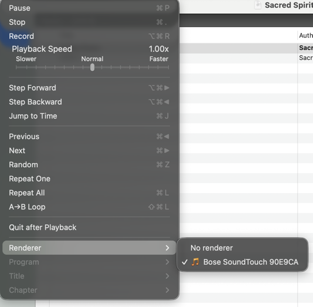

# VLC UPnP Renderer Plugin

Cast audio from VLC 3.0.x to UPnP/DLNA `MediaRenderer:1` devices — including the Bose SoundTouch IV — via **Playback → Renderer**.

This replaces the manual `dlna-sender/send-to-bose.py` workflow with native VLC integration.



## Quick start

```sh
cd vlc-upnp-renderer
./install.sh
```

`install.sh` handles everything: dependency checks, VLC header clone, CMake build, tests, and plugin deployment. Run `./install.sh --help` for all options.

**After install:** open VLC → **Playback → Renderer** → select your device (e.g. Bose SoundTouch) → play a local file or `http(s)://` stream.

On macOS, if VLC.app is not writable, plugins go to `~/.local/vlc/plugins` and `install.sh` creates `open-vlc.sh` to launch VLC with them:

```sh
./open-vlc.sh
```

## Requirements

- **VLC 3.0.x** — built and tested against 3.0.23; plugin ABI can break across major versions
- **CMake 3.16+** and a C compiler
- **git** (only needed on first run, to clone VLC headers)
- **macOS** (primary) or **Linux** — produces `.dylib` or `.so` plugins respectively

## Install & uninstall scripts

| Script | Purpose |
|--------|---------|
| [`install.sh`](install.sh) | Build, test, and deploy plugins |
| [`uninstall.sh`](uninstall.sh) | Remove deployed plugins |
| [`open-vlc.sh`](open-vlc.sh) | Launch VLC with a custom plugin directory (created by `install.sh` when needed) |

### Install

```sh
./install.sh                              # full build + install (recommended)
./install.sh --skip-tests                 # faster, skips ctest
./install.sh --skip-install               # build and test only
./install.sh --plugin-dir ~/.local/vlc/plugins   # install to a specific directory
./install.sh --help                       # all options
```

By default, plugins install into VLC's plugin directory. On macOS, if that directory is not writable (common with Gatekeeper), `install.sh` falls back to `~/.local/vlc/plugins` and writes `open-vlc.sh`.

### Uninstall

```sh
./uninstall.sh                            # remove from VLC's plugin directory
./uninstall.sh --all-locations            # also clean ~/.local/vlc/plugins
./uninstall.sh --remove-build             # also delete build/ artifacts
./uninstall.sh --help                     # all options
```

Only this project's plugins are removed (`libupnp_renderer_plugin`, `libupnp_cast_plugin`). VLC's built-in `libupnp_plugin` is never touched.

## Usage

1. Open VLC 3.0.x (use `./open-vlc.sh` if plugins are in a custom directory).
2. **Playback → Renderer** → select your device.
3. Play a local audio file or an `http(s)://` stream.

**Local files** — the plugin starts a temporary HTTP server so the renderer can fetch the file (same approach as `send-to-bose.py`).

**HTTP streams** — the URL is passed through unchanged.

## Manual build

If you prefer CMake directly:

```sh
# One-time: clone VLC headers at the version you run
git clone --depth 1 --branch 3.0.23 https://github.com/videolan/vlc.git /tmp/vlc-3.0.23

cmake -B build -DCMAKE_BUILD_TYPE=Release -DVLC_SRC_DIR=/tmp/vlc-3.0.23
cmake --build build
ctest --test-dir build --output-on-failure
```

Build artifacts:

```
build/libupnp_renderer_plugin.dylib   # SSDP discovery
build/libupnp_cast_plugin.dylib       # stream_out + demux_filter
```

Copy into VLC manually, or use `VLC_PLUGIN_PATH`:

```sh
VLC_PLUGIN_PATH="$(pwd)/build" open -a VLC
```

### CMake options

| Variable | Default | Purpose |
|----------|---------|---------|
| `VLC_DIR` | `/Applications/VLC.app/Contents/MacOS` on macOS | Installed VLC prefix |
| `VLC_SRC_DIR` | `/tmp/vlc-3.0.23` | VLC source tree with headers |
| `VLC_PLUGIN_DIR` | `$VLC_DIR/plugins` | Install destination |
| `BUILD_TESTS` | `ON` | Build and register unit tests |

## Tests

```sh
ctest --test-dir build --output-on-failure
```

| Test | What it checks |
|------|----------------|
| `ssdp_parse` | Parses `LOCATION` from SSDP M-SEARCH response fixture |
| `device_parse` | Extracts `friendlyName` and AVTransport control URL from Bose device XML |
| `soap_build` | Live `GetTransportInfo` SOAP call (skipped if Bose is offline) |

## Architecture

Two cooperating VLC modules:

| Module | Role |
|--------|------|
| `libupnp_renderer_plugin` | SSDP discovery → registers renderers in **Playback → Renderer** |
| `libupnp_cast_plugin` | `stream_out` casts media via SOAP; `demux_filter` syncs play/pause/seek/stop |

Shared C library code (no libupnp): SSDP, device XML parse, SOAP client, local HTTP server.

## Troubleshooting

| Problem | Things to try |
|---------|----------------|
| Bose not in Renderer menu | Same Wi-Fi subnet; Bose powered on; wait ~5 s for SSDP scan. Compare with `python3 dlna-sender/send-to-bose.py --status`. |
| Plugin not loading | Matching VLC minor version (3.0.23); both plugin files installed; check verbose log: `VLC_PLUGIN_PATH=~/.local/vlc/plugins vlc -vvv 2>&1 \| rg -i 'upnp\|renderer'` |
| Cannot write into VLC.app | Re-run `./install.sh` (auto-fallback to `~/.local/vlc/plugins`) or use `./open-vlc.sh`. |
| Cast starts but no audio | Confirm Bose plays the URL via `send-to-bose.py`. Check firewall allows inbound HTTP for local file serving. |

## Fallback

`dlna-sender/send-to-bose.py` remains a zero-build alternative if the plugin is not installed or SSDP is blocked.

## References

- `dlna-sender/send-to-bose.py` — working Python reference in this repo
- [VLC wiki: Writing modules](https://wiki.videolan.org/Writing_VLC_modules/)